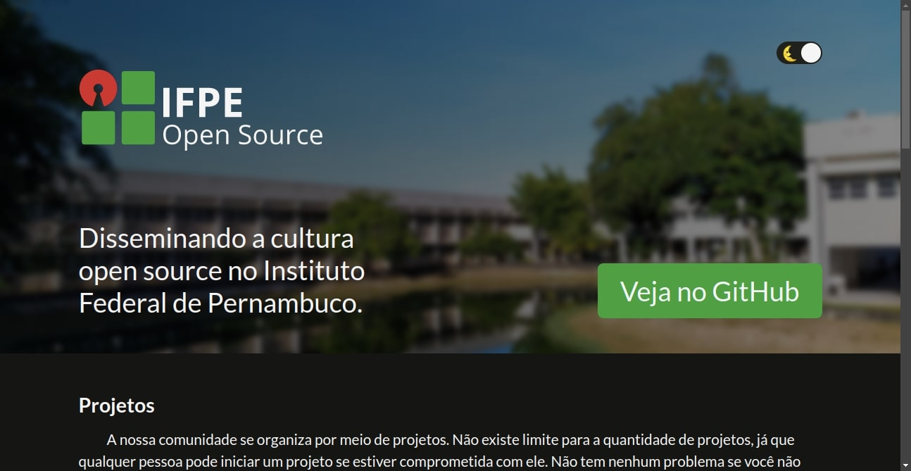

<h1 align="center">
  
</h1>

# Website

  

  
	
  

  

  <a href="https://ifpeopensource.com.br">
    </img>
  </a>

  

  
  

[Página](https://ifpeopensource.com.br) oficial da comunidade IFPE Open Source!

## 🔧 Como funciona?

O projeto foi feito em [TypeScript](https://github.com/microsoft/TypeScript) utilizando o framework [Next.js](https://github.com/vercel/next.js/).

## 👥 Time

Este projeto é mantido pelas seguintes pessoas e por esses [incríveis contribuidores](https://github.com/ifpe-open-source/website/graphs/contributors).

|  |  |
|-----------------------------------------------------------------------------------------------------|-----------------------------------------------------------------------------------------------------|
| [Welton Felix](https://github.com/weltonfelix)                                                                | [Fábio Papais](https://github.com/fabiopapais)                                                                |

## 🤝 Contribuir
Contribuições, issues e pedidos de features são bem-vindos! Sinta-se livre para checar a [página de issues](https://github.com/ifpe-open-source/website/issues). 
- Crie um fork;
- Crie um branch com a sua feature: `git checkout -b minha-feature`;
- Faça um commit com as mudanças: `git commit -m 'feat: Minha nova feature'`;
- Faça um push para o seu branch: `git push origin minha-feature`.

Após a sua pull request ser aceita, você pode excluir o seu branch.

## 🌟 Demonstre o seu apoio

Dê uma ⭐️ se este projeto lhe ajudou!

## 📝 Licença

O website do IFPE Open Source está sob a licença MIT. Veja o arquivo [LICENSE](LICENSE) para mais detalhes.

***
Feito com ♥ por Welton Felix :wave: [Entre em contato!](mailto:welton@ifpeopensource.com.br) e por Fábio Papais :wave: [Entre em contato!](mailto:fabio@ifpeopensource.com.br) no [ IFPE Open Source](https://ifpeopensource.com.br)
